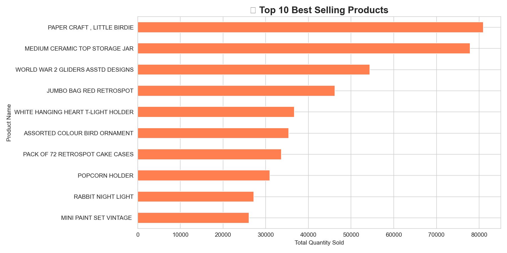
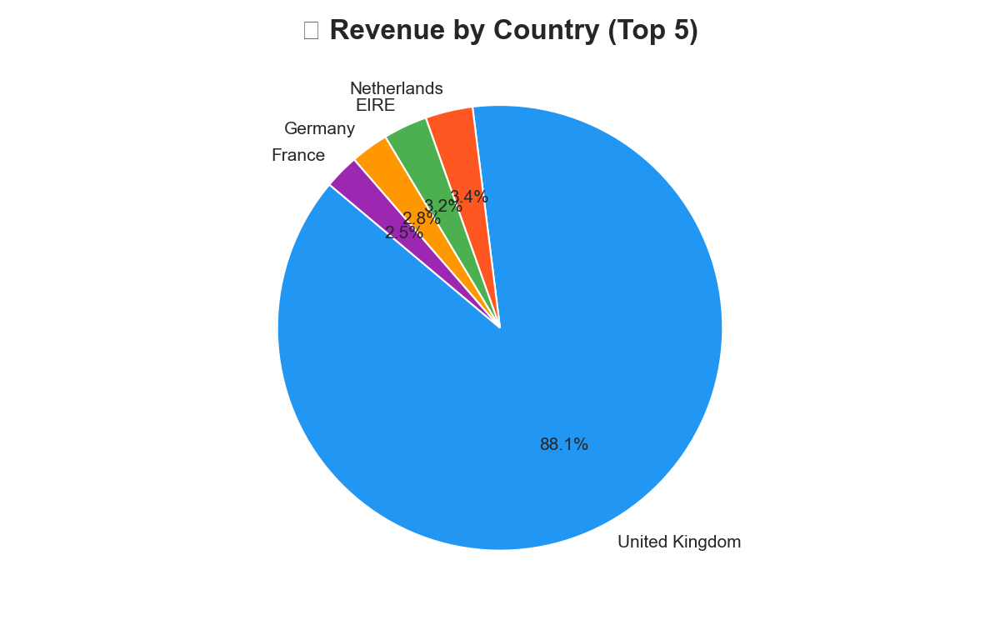
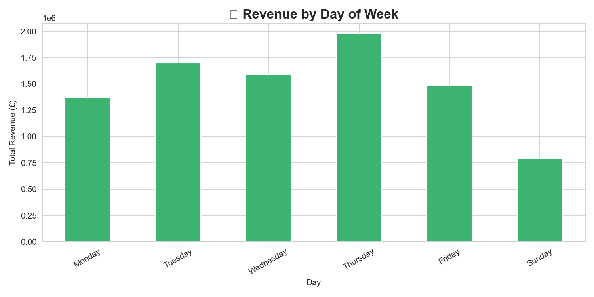

# Retail Sales Analysis using Python 📊

## Project Overview
This project focuses on analyzing retail sales data using Python.  
The analysis includes data cleaning, revenue analysis, product performance insights, and visualizations to understand sales trends.

---

## Tools & Libraries Used
- Python
- Pandas
- Matplotlib
- Seaborn

---

## Project Features
✔ Data Cleaning  
✔ Handling Missing Values  
✔ Removing Cancelled Orders  
✔ Revenue Calculation  
✔ Monthly Revenue Analysis  
✔ Top Selling Products Analysis  
✔ Country-wise Revenue Analysis  
✔ Day-wise Sales Analysis  
✔ Data Visualization

---

## Key Insights
- Identified top-performing products
- Analyzed monthly revenue trends
- Compared revenue across countries
- Found best sales days of the week

---

## Dataset Information
Dataset used: Online Retail Dataset

Note: Dataset file was not uploaded because of large file size.

---

## Visualizations

### Monthly Revenue Trend

---

### Top 10 Best Selling Products

---

### Revenue by Country

---

### Revenue by Day of Week

---

## Author
Mehak Sharma
